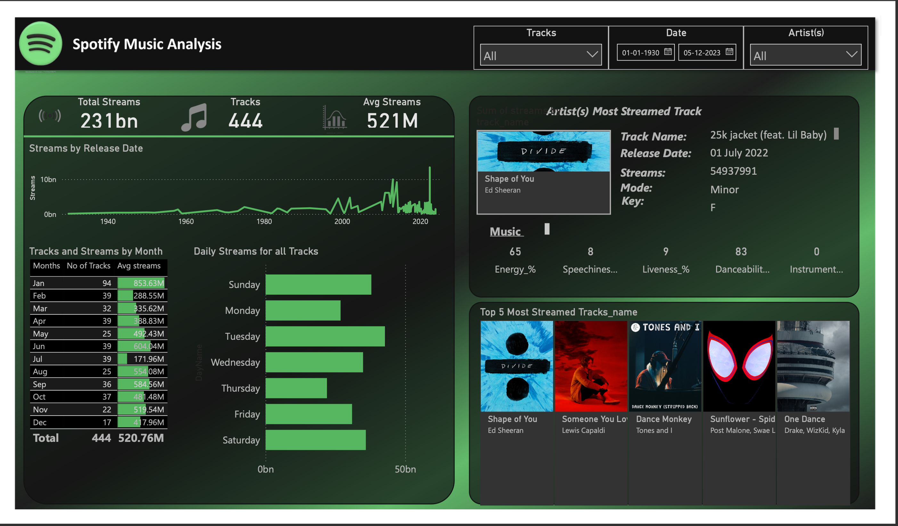

# 🎵 Spotify Power BI Dashboard

This project is an interactive Power BI dashboard using Spotify data.

## 🚀 Features
- Overview of top tracks and artists
- Genre distribution and trends
- Popularity insights by month and day
- Daily and total stream statistics
- Interactive filters for artist, date, and more

## 📸 Dashboard Preview

## 🛠 Tools & Technologies Used
- Power BI Desktop
- DAX
- Data Modeling
- Public Spotify Dataset

## 📂 Project Files
- `Spotify.pbix` — Main Power BI dashboard file
- `images/dashboard-preview.png` — Screenshot of the dashboard

## 💡 Notes
This is a personal learning project. No confidential or company data is used.
